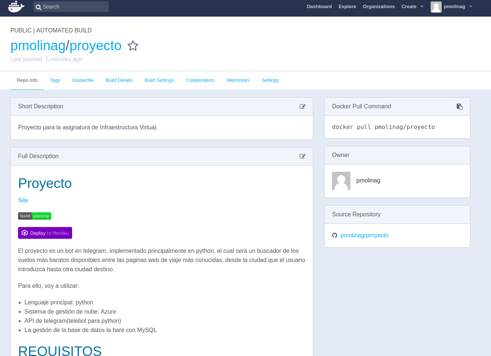
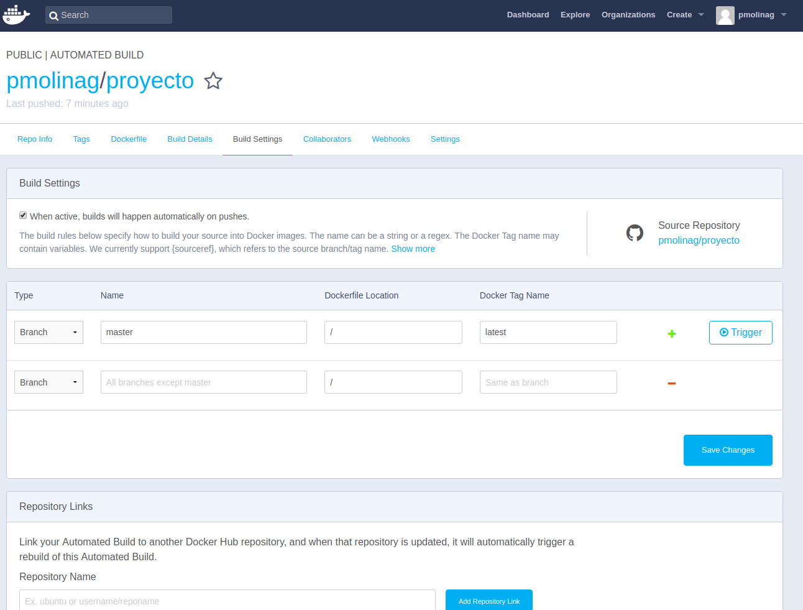
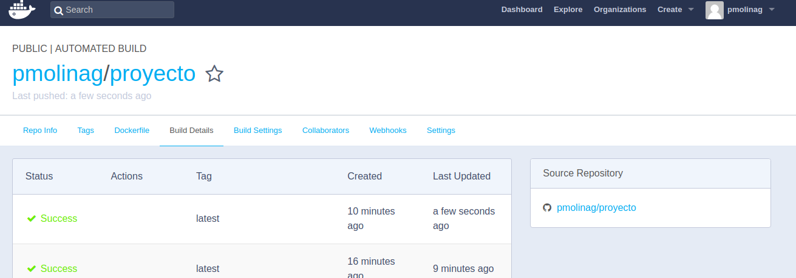

## Proyecto

[Site](https://pmolinag.github.io/proyecto/)

El proyecto es un bot en telegram, implementado principalmente en python, el cual será un buscador de los vuelos más baratos disponibles entre las paginas web de viaje más conocidas, desde la ciudad que el usuario introduzca hasta otra ciudad destino.

Para ello, voy a utilizar:

- Lenguaje principal: python
- Sistema de gestión de nube: Azure
- API de telegram(telebot para python)
- La gestión de la base de datos la haré con MySQL

## REQUISITOS
Instalamos una libreria que nos ayudara a recoger datos de las webs de vuelos:
- sudo apt-get install python-bs4 o pip install beautifulsoup4

Tambien instalaremos la libreria request para poder descargarnos paginas web enteras, para luego poder recoger sus datos.

- pip install requests

Y, por supuesto, tener instalado Python
- sudo apt-get install python

Tambien instalamos la API que nos va a facilitar el desarrollo del bot para Telegram:

- git clone https://github.com/eternnoir/pyTelegramBotAPI.git
- cd pyTelegramBotAPI
- sudo python setup.py install

O con pip:

- sudo pip install pyTelegramBotAPI

y seguimos estas instrucciones necesarias para que nos den nuestro token particular, para poder trabajar con el a lo largo del desarrollo del bot.

Para poder utilizar esta API, primero vamos a tener que regristar nuestro bot y disponer del token que nos proporciona el bot llamado The BotFather. Es muy simple, únicamente hay que abrir conversación desde Telegram con @BotFather y seguir los pasos: una vez tenemos abierto chat con @botfather, enviamos el siguiente mensaje para crear nuestro bot: /newbot y The BotFather nos preguntará por el nombre de nuestro bot (nombre que será visible) y el nombre de usuario (un nombre corto entre 5-32 caracteres y que debe acabar con la palabra bot).
Con todo esto The BotFather nos contestará con un string que será nuestro TOKEN y utilizaremos en nuestra programación Python para identificarnos.

## INTEGRACION CONTINUA

Esta práctica consiste en tener un proceso automatizado que, después de que cada desarrollador suba código al repositorio, se obtenga la última versión, se compile, se ejecuten el conjunto de pruebas unitarias seleccionado, y se dejen los binarios/resultados en una ubicación conocida.

Las ventajas de esto son claras, la primera, cada vez que alguien sube algo al control de código fuente, tenemos un proceso que verifica que al menos la integración, y las pruebas unitarias se ejecutan y sabemos el resultado.

Otra gran ventaja, orientada a la entrega de valor, es que sin un esfuerzo adicional, en cualquier momento del sprint o iteración, podemos disponer de un conjunto de binarios, compilados con la última versión, y con su conjunto de pruebas unitarias pasadas, de modo que podemos pasar a un entorno de despliegue para poder enseñarlo a las partes interesadas, realizar pruebas más exhaustivas, o incluso, en casos de urgencia hacer un despliegue rápido.

El motivo por el que he eligido TravisCI es porque te permite conectarlo facimente a Github y esta compuesto de multiples runtimes (Node.js, o versiones de PHP, por ejemplo) o data stores. De este modo, podemos probar nuestras librerías o aplicaciones contra distintas configuraciones sin tener que tenerlas instaladas localmente.

## Paas
El PaaS elegido es keroku debido a la rapidez con la que se puede desplegar aquí un aplicacion en la nube, a parte de que soporta una gran cantidad de lenguajes.
Es necesario tener git instalado. Suponiendo que lo tenemos instalado, pasamos a instalar heroku.
Para Ubuntu:

- wget -qO- https://cli-assets.heroku.com/install-ubuntu.sh | sh

Una vez instalado, hacemos login con:

- heroku login

Creamos la app:

- heroku create   (esto le asigna un nombre por defecto que luego en la web puedes cambiar)

Para mas informacion sobre como desarrollar la aplicacion en Heroku, Heroku tiene un manual:
https://devcenter.heroku.com/start

Para conectar nuestro repositorio con heroku, lo hacemos remoto con:

- heroku git:remote -a nombre_app

Por ultimo, para desplegar nuestra aplicacion en Heroku, desde el repositorio que queremos desplegar, hacemos:

- git push heroku master

Para lanzar el bot y el servicio web, inicializamos dyno:

- heroku ps:scale web=1 --app flyfinder (servicio web)
- heroku ps:scale worker=1 --app flyfinder (bot Flyfinder)

Para comprobar, hacemos:

- heroku ps

Si estan los 2 servicios en up, está correctamente inicializado.

Lo abrimos:

- heroku open

Despliegue https://flyfinder.herokuapp.com/

## Despliegue de contenedores Docker en en DockerHub y Azure
El primer paso va a ser crearnos un repositorio en Docker Hub y lo enlazamos con nuestro de github tal y como se explica en el siguiente link(pongo el enlace directamente porque hay que configurarlo por la web, no por comandos, y me evito llenar esto de fotos).

- [Comenzar en Docker hub](https://github.com/docker/dceu_tutorials/blob/master/08-Automated-builds.md)

Quedará tal que así:

A continuación, creamos el archivo Dockerfile y lo subimos a nuestro repositorio de Github para poder obtener una imagen Docker.

Hacemos:
- docker pull pmolinag/proyecto
- docker run -i -t pmolinag/proyecto:latest /bin/bash (con este comando vemos si funciona)

Despliegue hecho en: https://hub.docker.com/r/pmolinag/proyecto/

Pasamos a Azure.

Nos creamos una cuenta free trial en azure o pedimos un cupon a JJ.
Una vez dentro, vamos a marketplace -> web y movil y buscamos Web App for Containers.
Le damos a obtener ahora y rellenamos los campos así:

Y ya lo tenemos, solo falta cambiarle el puerto al Dockerfile añadiendo esto al final:

- EXPOSE 8000
- WORKDIR proyecto/
- CMD gunicorn vuelos_rest:app --log-file - --bind 0.0.0.0:8000

Cabe recalcar que todo esto tambien se puede hacer por la linea de comando que tiene Azura, az, tal y como se explica en este tutorial:

[Tutorial Azure](https://docs.microsoft.com/es-es/azure/app-service/containers/tutorial-custom-docker-image)

Contenedor: http://proyecto-iv.azurewebsites.net/status

